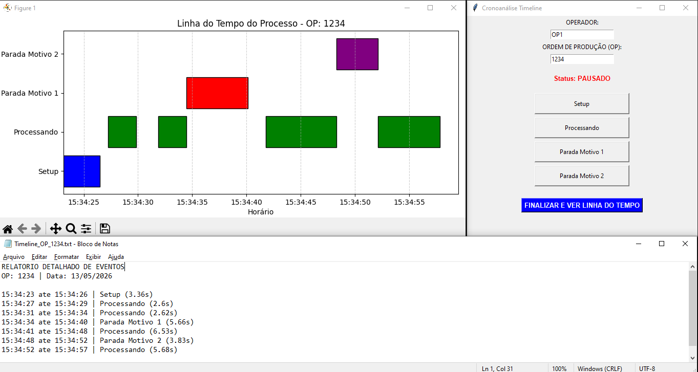

# Cronoanálise Process Timeline (v1 - Python Desktop)

## 📋 Sobre o Projeto
Este software foi desenvolvido para automatizar o processo de cronoanálise industrial. Ele substitui registros manuais por uma interface simples onde o operador registra cada etapa da produção (Setup, Processamento, Paradas) em tempo real.

O sistema foca na precisão da coleta de dados e na facilidade de visualização para gestores de produção.

## ✨ Funcionalidades
- **Registro de Eventos:** Captura precisa de horários de início e fim.
- **Visualização Visual (Gantt):** Geração automática de uma linha do tempo utilizando `Matplotlib`.
- **Relatório Detalhado:** Exportação de logs em formato `.txt` para análise posterior.

## 🛠️ Tecnologias Utilizadas
- **Python** (Lógica principal)
- **Tkinter** (Interface Gráfica)
- **Matplotlib** (Renderização de gráficos)

## 📸 Demonstração

---

## 🚀 Evolução do Projeto
Este projeto evoluiu de uma ferramenta desktop local para uma **plataforma Web escalável**. A versão atual utiliza:
- **TypeScript**
- **Supabase** (Banco de dados e Autenticação)
- **Vercel** (Deploy e Cloud)

---
## ⚙️ Como executar
1. Instale as dependências: `pip install -r requirements.txt`
2. Execute o programa: `python main.py`